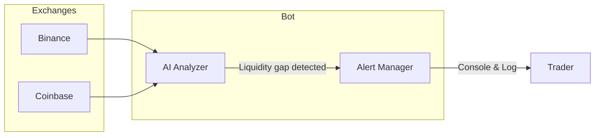

<p align="center">
  
</p>

<h1 align="center">🕷️ AI Liquidity Gap Alert Bot</h1>
<div align="center">
 
  [](https://t.me/spidertrading100)

  ---
</div>
<p align="center">
  <strong>Detect sudden liquidity gaps in order books before they move the market.</strong>
</p>
<p align="center">
  <em>Get ahead of price spikes and crashes—alerts that lead, not lag.</em>
</p>

<p align="center">
  
  
  
</p>

---

## 💡 The Idea

**Liquidity gaps**—when large buy or sell walls suddenly vanish from order books—often precede rapid price moves. Big players don't announce their exits. They pull orders quietly. By the time traditional indicators react, the move has already started.

This bot **watches order books in real time**, detects when significant walls disappear, and **alerts you before the market moves**.

---

## 🎯 Why Traders Want It

| What You Get | Why It Matters |
|--------------|----------------|
| **Early signal** | Liquidity changes often move markets *before* RSI, MACD, or volume react |
| **Multi-exchange** | Monitors Binance and Coinbase simultaneously |
| **Configurable thresholds** | Track walls from $100k to $10M+ — tune to your style |
| **Confidence scores** | AI-inspired scoring based on wall size, removal speed, and proximity to mid |

> *"When big players pull their orders, it can signal an imminent move."*

---

## 🔄 How It Works

```
┌─────────────────┐     ┌─────────────────────┐     ┌─────────────────┐
│   Order Books   │ ──► │   AI Analyzer       │ ──► │  Real-time      │
│  Binance        │     │   Detects wall      │     │  Alerts         │
│  Coinbase       │     │   disappearances    │     │  Console / Log  │
└─────────────────┘     └─────────────────────┘     └─────────────────┘
```

1. **Monitors** order books from Binance and Coinbase via WebSocket
2. **AI analyzes** large buy/sell walls (≥ $500k by default) and tracks when they disappear
3. **Alerts** traders before potential price spikes or crashes

---

## 📺 Learn More: Order Books & Liquidity

Understanding order book dynamics helps you get the most from this bot. Here are some excellent resources:

| Resource | Description |
|----------|-------------|
| [📹 Order Book in Crypto Explained Simply](https://www.youtube.com/watch?v=72rrMeMCMFU) | Full tutorial on how order books work |
| [📹 Buy & Sell Walls (and How They're Manipulated)](https://www.youtube.com/watch?v=ZHTH0Eg6rCQ) | Deep dive into walls and market manipulation |
| [📹 Order Book Heatmaps & Market Depth](https://www.youtube.com/watch?v=Q6Ybxw-fnxM) | Visualizing liquidity with heatmaps |

---

## 📸 How It Works (Visual)



---

## 📬 Example Alert

```
==================================================
  🔔 Liquidity Gap Detected
==================================================
  Symbol:      BTC/USDT
  Exchange:    Binance
  Event:       Buy wall removed
  Direction:   Possible upward breakout
  Confidence:  82%
==================================================
```

---

## 🚀 Quick Start

```bash
# Clone and enter the project
cd liquidity_gap_bot

# Install dependencies
pip install -r requirements.txt

# Run the bot
python main.py
```

The bot starts monitoring immediately. Press `Ctrl+C` to stop.

---

## ⚙️ Configuration

Edit `config.py` to customize behavior:

| Option | Default | Description |
|--------|---------|-------------|
| `symbols_binance` | `["BTC/USDT", "ETH/USDT"]` | Pairs to monitor on Binance |
| `symbols_coinbase` | `["BTC/USD", "ETH/USD"]` | Pairs to monitor on Coinbase |
| `exchanges` | `["binance", "coinbase"]` | Which exchanges to watch |
| `min_wall_size_usd` | `500_000` | Minimum wall size to track (USD) |
| `wall_removal_threshold` | `0.8` | % of wall that must disappear (80%) |
| `time_window_seconds` | `60` | Max time for "sudden" removal |
| `min_confidence` | `0.6` | Minimum confidence to alert (0–1) |

---

## 📁 Project Structure

```
liquidity_gap_bot/
├── main.py              # Entry point
├── config.py            # Configuration
├── requirements.txt
├── src/
│   ├── exchanges/       # Order book monitors (WebSocket)
│   │   ├── binance.py
│   │   └── coinbase.py
│   ├── analyzer/        # Liquidity gap detection
│   │   └── liquidity_analyzer.py
│   └── alerts/          # Alert output
│       └── alert_manager.py
```

---

## 📊 Confidence Score

The AI-inspired confidence (0–100%) considers:

- **Wall size** — Larger walls = more significant
- **Removal speed** — Faster disappearance = more suspicious
- **Proximity to mid** — Closer to current price = more impactful

---

## 🔔 Alert Output

- **Console** — Alerts print to stdout in real time
- **File** — Alerts append to `alerts.log` (configurable)

To add **Discord** or **Telegram** alerts, extend `src/alerts/alert_manager.py`.

---

---

<br>

<div align="center">

### 🕸️ **SPIDER TRADING**

```
┌─────────────────────────────────────────┐
│  📱 TELEGRAM: @spidertrading100         │
│                                         │
│  Questions • Feedback • Custom builds   │
└─────────────────────────────────────────┘
```

[](https://t.me/spidertrading100)

---

*Built for traders who want to stay ahead of the market.*

</div>
